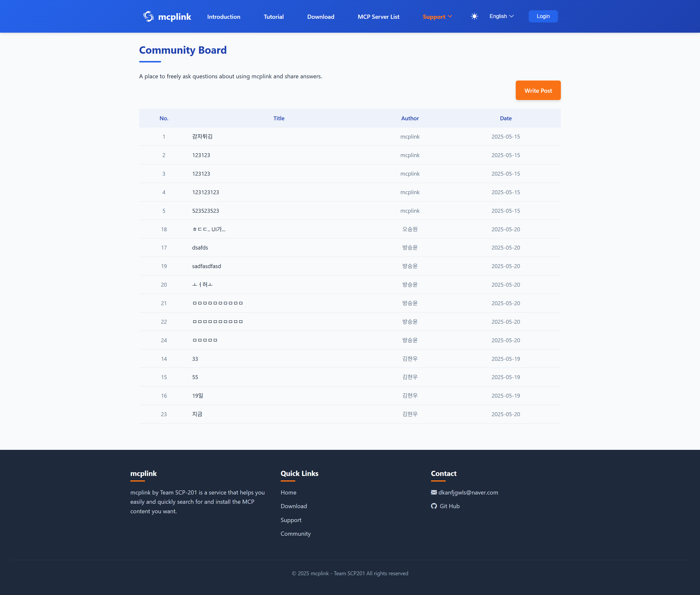
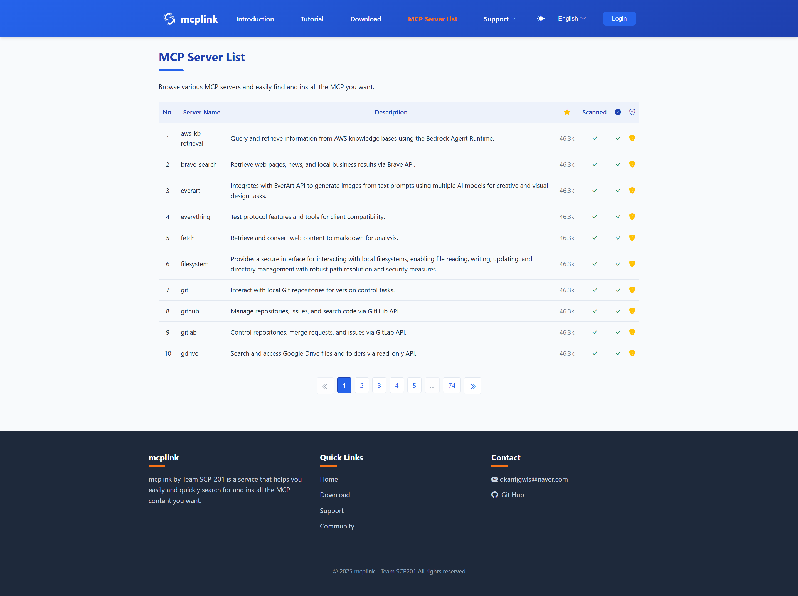
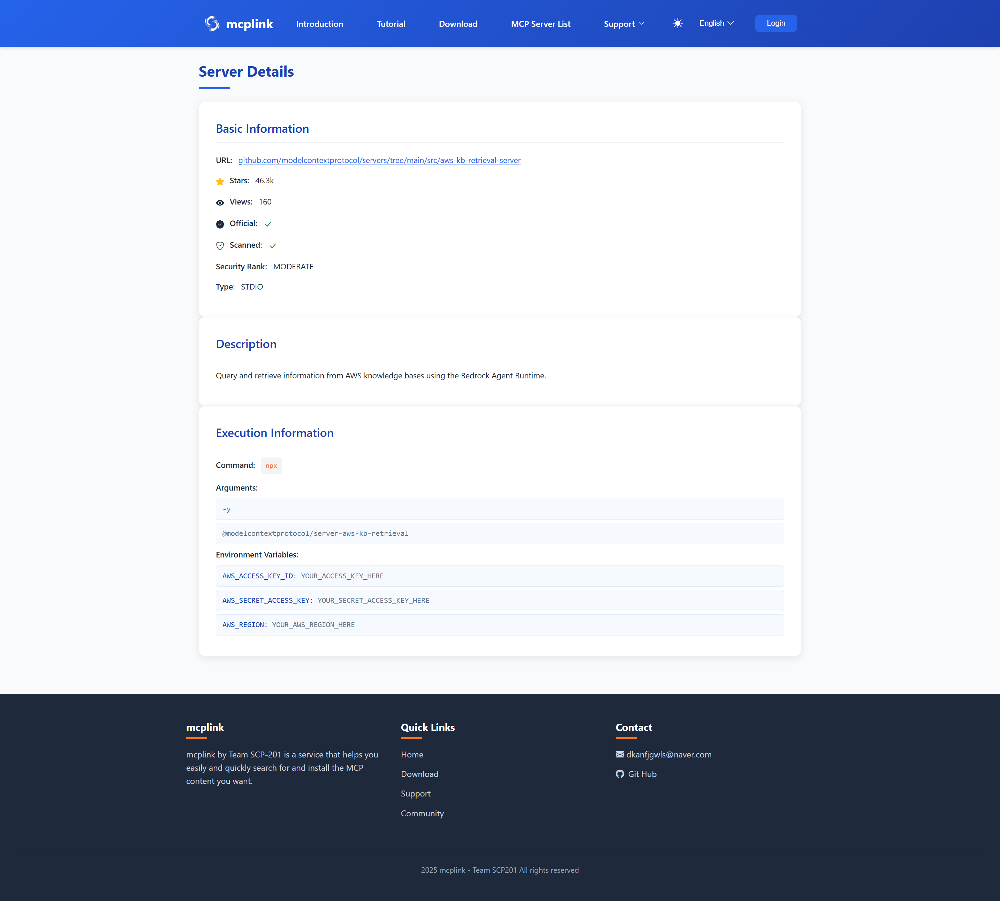
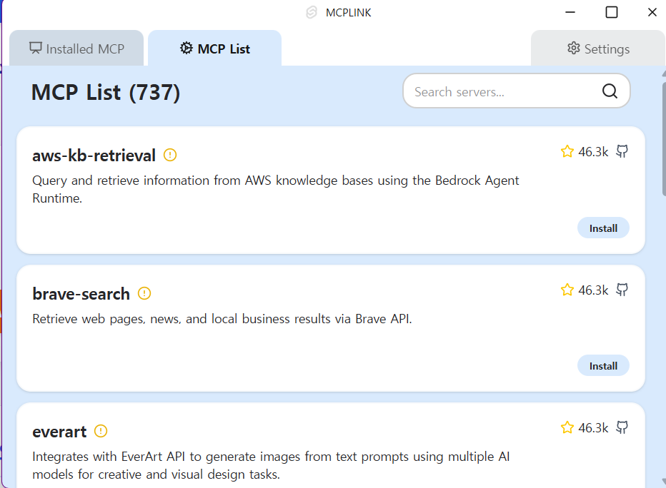
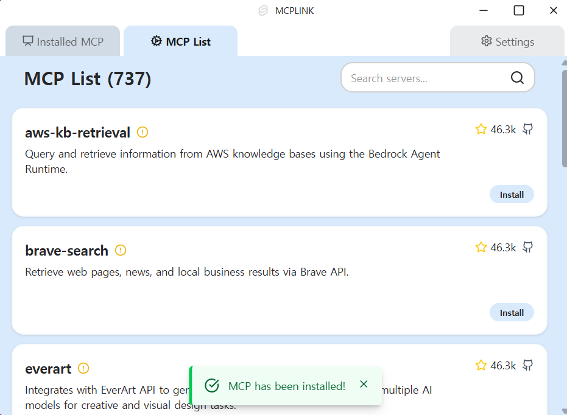
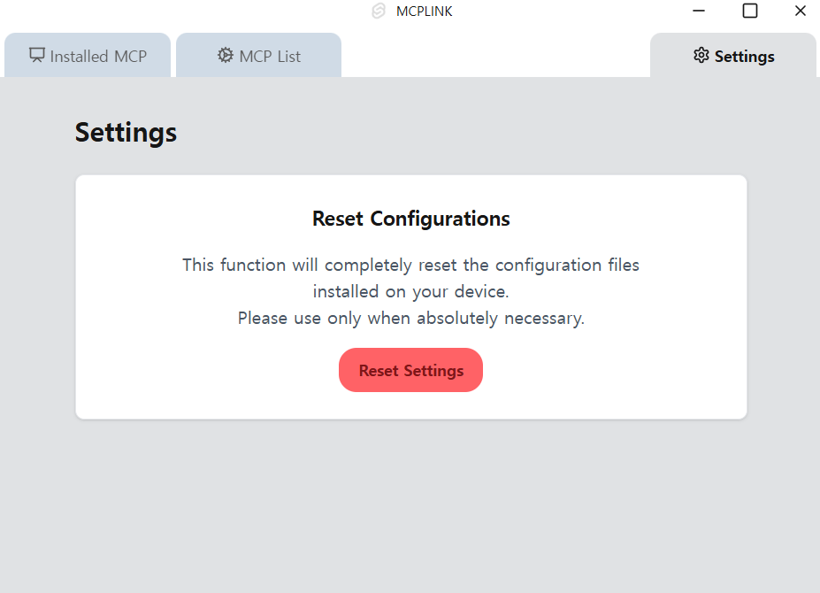
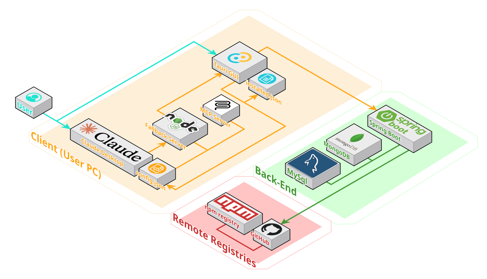
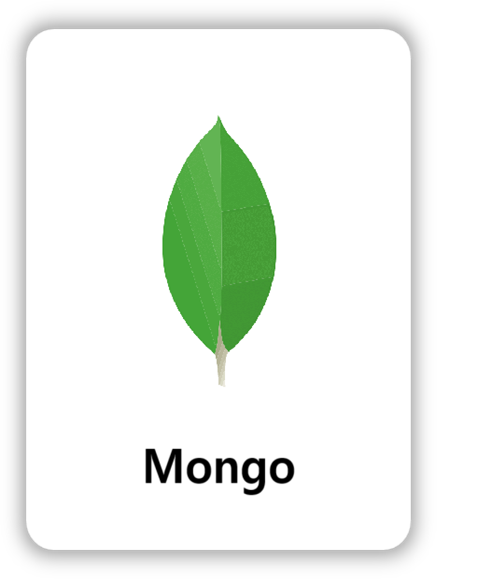
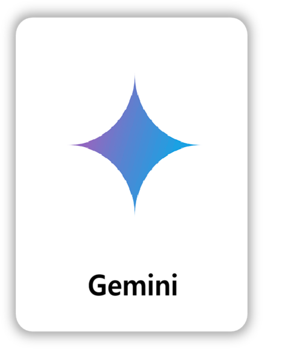

# Mcplink

> 데스크탑에서 MCP 서버를 원클릭으로 설치·관리할 수 있는 애플리케이션

## Contents

1. [기획 의도](#기획-의도)
2. [주요 기능](#주요-기능)
3. [서비스 화면](#서비스-화면)
4. [프로젝트 아키텍처](#프로젝트-아키텍쳐)
5. [기록](#기록)
6. [기술 스택](#기술-스택)
7. [프로젝트 일정](#프로젝트-일정)
8. [프로젝트 팀원 & 역할](#프로젝트-팀원-역할)

## 기획 의도

> 2024년 10월 Anthropic Claude에서 표준으로 내놓은 MCP Server 설치하는 데 많은 번거로움이 있었음
> 서버를 확인하고 설치, 삭제하는 번거로움, 불편함을 줄이고자 만든 데스크탑 애플리케이션

## 주요 기능

### 데스트탑 애플리케이션

- **로컬 MCP 목록 조회**: 호스트 시스템에 설치된 MCP 인스턴스를 스캔하여 메타데이터 기반 목록을 출력

- **서버 등록 MCP 전체 조회**: MCP 서버에서 정합성 검사를 거친 MCP 전체 목록을 정렬된 형태로 제공

- **클로드 데스크탑 앱 연동 설치 지원**: GUI 기반의 클로드 데스크탑 앱과 연동되어, MCP를 원클릭으로 설치하고 자동 등록

- **MCP 삭제 및 수정 기능**: 설치한 MCP 설정을 수정, 삭제

- **백그라운드 서비스 지원**: 데스크탑 앱이 최소화되거나 종료되어도 MCP 관리 기능은 백그라운드에서 지속적으로 동작

### 웹페이지

- **튜토리얼**": 애플리케이션을 사용하기 위한 가이드 제공

- **데스크탑 앱 다운로드**

- **OAuth**: SSAFY 계정 기반의 OAuth 2.0 인증을 통해 보안성 있는 사용자 인증 및 관리

- **게시글 관리**: 게시글 작성 및 조회 가능

- **MCP Server 목록 조회**: 수집한 MCP Server 조회 및 안전도 표시

- **다국어 및 다크모드**: 한국어 / 영어 지원 및 다크모드 제공

- **osv-scanner 라이브러리 검사**: mcp 실제 코드를 확인해 스캔하여 취약점이 있는 라이브러리를 사용할 경우 위험도 표시

---

## 서비스 화면

  
&nbsp;&nbsp;웹 사이트 화면

|                     **소개 페이지**                      |                    **데크스탑 애플리케이션 다운로드**                     |
|:---------------------------------------------------:|:-----------------------------------------------------------:|
|  |                   |
|                       **FAQ**                       |                        **게시판 글 목록**                         |
|                   |   |
|                   **MCP Server**                    |                    **MCP Server 상세페이지**                     |
|  |  |

&nbsp;&nbsp;데스크탑 애플리케이션 화면

|                **MCP Server 목록**                |                  **MCP Server 검색**                  |
|:-----------------------------------------------:|:---------------------------------------------------:|
|         |           |
|                **설치한 Server 목록**                |                     **설정 초기화**                      |
|  |  |

## [API 명세서](https://www.notion.so/1e013cd52d71807b9c9bc8c4ae14e31f?pvs=25)

## 프로젝트 아키텍쳐

 

# 기록

- **MongoDB 설치**: EC2 서버, Docker 활용한 설치 방법

    - [MongoDB](https://www.notion.so/EC2-MongoDB-1e513cd52d7180828330cf40b78fa515?pvs=4)

- **Linux, Vim, Docker**: 실제로 자주 사용한 명령어
    - [서버 명령어](https://www.notion.so/Linux-vim-docker-1eb13cd52d7180a297c8ff4f14a56632?pvs=4)

---

# 기술 스택

  

    <h3>Desktop Application</h3>
    
     
    

  

  

    <h3>MCP Server</h3>
    
    

  
  

  

    <h3>Web Frontend</h3>
    
     
    
    

  

  

    <h3>Web Backend</h3>
    
    
     
    
    
  

  

    <h3>Infra</h3>
    
    
     
    
    
    
  

 

  

    <h3>Others</h3>
    
     
    
    
  

---

# 프로젝트 일정

### 기획: 04.14 ~ 04.18 (5일)

### 개발: 04.21 ~ 05.16 (1달)

### 테스트 : 05.02 ~ 05.16 (2주)

### 프로젝트 종료: 2025.05.22

---

# 프로젝트 팀원 역할

## 김동욱

## 김성현

## 김현우

- 인프라 총괄, 웹 백엔드, 웹 프론트 담당
- GitHub Actions 기반 정적 페이지 EC2 자동 배포
- GitLab Jenkins 기반 CI/CD 자동 배포
- 구글 오픈소스 osv-scanner 이용한 mcp-server 라이브러리 검사 및 스케줄링
- Oauth2.0 로그인 필터기반 인증 인가 처리
- 웹페이지 게시판 백엔드 CRUD 로직 구현
- 웹페이지 메인 화면 구성

## 방승윤

- 데스크탑 애플리케이션에서 MCP 서버 설정 추가 및 Claude 애플리케이션 재시작 기능 구현
- 웹페이지 주요 화면(다운로드, 게시판, MCP 서버, FAQ) 프론트엔드 구성
- 반응형 웹페이지 및 햄버거 버튼, 드롭다운 메뉴 UI 구현
- 다크모드 및 다국어 지원 기능 구현으로 사용자 편의성 강화
- AWS S3 기반의 MCP 서버 설치파일 다운로드 기능 구현 및 연동

## 오승원

- 서비스 기획, 테스트 및 디버깅 담당
- 안정적인 기능 구현을 위해 서비스 아키텍처 기획
- 서비스 구현 가능성 테스트를 위해 1차 MVP 구현
- TypeScript, Node.js, Spring Boot 이용, MCP 서버 통신 구현
- Oauth 2.0 구현을 위한 FrontEnd 구현 및 테스트, 디버깅

## 오완진

- Spring Boot와 MongoDB 기반의 백엔드 및 외부 API 연동 담당
- MCP Server 대상 크롤링, 메타데이터 저장과 API 제공을 위한 CRUD 로직 구현
- 한글 검색을 위한 MongoDB Atlas 연동, 인덱스 구성과 쿼리 최적화
- GitHub API를 활용한 MCP Server 레포지토리 크롤링, 필터링 및 메타데이터 수집
- Gemini API를 활용한 README 요약 및 관련 태그 자동 생성
